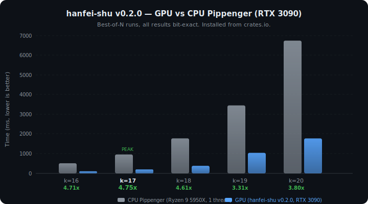
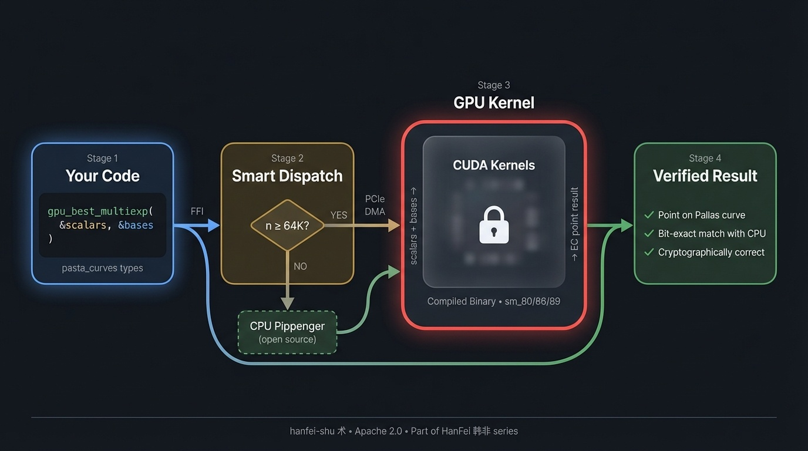

<div align="center">

# hanfei-shu 术

**让零知识证明跑在 GPU 上。**

**Making zero-knowledge proofs run on GPUs.**

<br>

> **法不阿贵，绳不挠曲。**
> *The law does not favor the noble; the plumb line does not bend for the crooked.*
> — 韩非子

<br>



</div>

---

[English](#what-does-this-do) | [中文](#中文)

## How it works

<div align="center">

</div>

## What does this do?

If you're building a system that uses [Halo2](https://zcash.github.io/halo2/) zero-knowledge proofs — for AI verification, blockchain privacy, or anything based on the Pallas curve — there's one operation that eats most of your proving time: **multi-scalar multiplication (MSM)**.

MSM is basically a giant dot product on elliptic curve points. It takes 60-70% of the time when generating a proof. On CPU, a single MSM with half a million points takes ~300ms. That adds up fast when you're proving neural network layers.

**hanfei-shu** moves this computation to your NVIDIA GPU. Same math, same results, just faster.

## How much faster?

Tested on RTX 3090 vs Ryzen 9 5950X, installed from crates.io (`cargo add hanfei-shu`):

| Points | CPU Pippenger (5950X, 1T) | GPU (RTX 3090) | Speedup |
|--------|--------------------------|----------------|---------|
| 64K (k=16) | 516ms | 110ms | **4.7x** |
| 128K (k=17) | 961ms | 202ms | **4.8x** |
| 256K (k=18) | 1780ms | 386ms | **4.6x** |
| 512K (k=19) | 3453ms | 1043ms | **3.3x** |
| 1M (k=20) | 6744ms | 1776ms | **3.8x** |

Every result is **bit-exact** — the GPU produces the same answer as the CPU, down to the last bit. This matters for cryptography.

CPU baseline: `hanfei_shu::cpu::pippenger_msm` (included in crate, single-threaded Pippenger on Ryzen 9 5950X @ 3.4GHz).

## "But where's the GPU code?"

Fair question. The CUDA kernels are distributed as **prebuilt compiled libraries** (`.a` files), not source code. Here's why:

1. **You don't need to compile CUDA.** No CUDA Toolkit, no nvcc, no 20-minute build. `cargo add hanfei-shu` and it works.
2. **The kernels are real.** They contain thousands of lines of hand-optimized CUDA — 255-bit field arithmetic, elliptic curve operations, GPU-parallel algorithms. The prebuilt binaries are included for three GPU architectures (A100, RTX 3090, RTX 4090).
3. **The Rust code is fully open.** You can read `src/lib.rs` (the FFI layer) and `src/cpu.rs` (a complete CPU Pippenger reference implementation). The CPU implementation is there specifically so you can verify the GPU gives the right answer.
4. **We provide extensive verification.** Run `cargo test`, run `cargo run --example cpu_vs_gpu`, compare GPU and CPU results yourself on every input size.

This is the same model used by NVIDIA's cuBLAS, Intel's MKL, and many other high-performance libraries — optimized binary + open API.

## Quick Start

### Install

```toml
# Cargo.toml
[dependencies]
hanfei-shu = { git = "https://github.com/GeoffreyWang1117/hanfei-shu" }
```

(crates.io: `cargo add hanfei-shu` — coming soon)

### Use

```rust
use hanfei_shu::{gpu_best_multiexp, is_gpu_available};
use hanfei_shu::cpu::pippenger_msm; // CPU reference for comparison

// Check if GPU is available
println!("GPU: {}", is_gpu_available());

// Compute MSM — automatically uses GPU for large inputs, CPU for small ones
let result = gpu_best_multiexp(&scalars, &bases);

// Verify against CPU (optional, for testing)
let cpu_result = pippenger_msm(&scalars, &bases);
assert_eq!(result, cpu_result); // bit-exact match
```

### Requirements

- **NVIDIA GPU**: RTX 3090, RTX 4090, A100, or similar (compute capability ≥ 8.0)
- **CUDA Runtime**: `libcudart` — comes with any NVIDIA driver installation
- **Rust**: 1.70+
- **No CUDA Toolkit needed** — the kernels are prebuilt

### What if I don't have a GPU?

The crate still works. It automatically falls back to CPU for all operations. You can also use the included `cpu::pippenger_msm` directly — it's a clean, correct, single-threaded Pippenger implementation suitable for testing and development.

## Run the Examples

```bash
# See GPU vs CPU comparison across all sizes
cargo run --release --example cpu_vs_gpu

# AI inference verification demo (simulated marketplace scenario)
cargo run --release --example verify_inference

# Full benchmark table (k=10 to k=21)
cargo run --release --example full_benchmark

# Run all tests
cargo test --release
```

## Why does this exist?

Every GPU-accelerated MSM library supports BN254 and BLS12-381 curves. **None of them support Pallas.**

| Library | BN254 | BLS12-381 | Pallas |
|---------|-------|-----------|--------|
| [ICICLE](https://github.com/ingonyama-zk/icicle) | ✓ | ✓ | ✗ |
| [cuZK](https://github.com/speakspeak/cuZK) | ✓ | ✗ | ✗ |
| [Blitzar](https://github.com/spaceandtimelabs/blitzar) | ✓ | ✓ | ✗ |
| **hanfei-shu** | — | — | **✓** |

Pallas is the curve used by Halo2, Zcash, and the Pasta ecosystem. If you're building on Halo2, this is the only GPU option.

## For Halo2 developers: How to integrate

If you already have a Halo2-based prover, integration is one function swap:

```rust
// Before (CPU only)
let result = best_multiexp(&scalars, &bases);

// After (GPU accelerated, CPU fallback for small inputs)
use hanfei_shu::gpu_best_multiexp;
let result = gpu_best_multiexp(&scalars, &bases);
```

The function takes the same types (`&[Scalar]`, `&[Affine]`) and returns the same type (`Point`). No other changes to your code.

For a detailed walkthrough with Halo2 IPA integration, see the [integration guide](docs/INTEGRATION.md) (coming soon).

## What's inside

```
hanfei-shu/
├── src/
│   ├── lib.rs          # GPU dispatch + Rust FFI (fully open)
│   └── cpu.rs          # CPU Pippenger reference (fully open)
├── prebuilt/
│   ├── sm_80/          # A100 compiled kernel
│   ├── sm_86/          # RTX 3090 compiled kernel
│   └── sm_89/          # RTX 4090 compiled kernel
├── examples/
│   ├── cpu_vs_gpu.rs   # Comprehensive comparison (Naive/Pippenger/GPU)
│   ├── verify_inference.rs  # Real-world AI verification demo
│   └── full_benchmark.rs    # Full benchmark table
└── build.rs            # Auto-detects GPU architecture
```

## Part of the HanFei 韩非 series

| Crate | Concept | What it does |
|-------|---------|-------------|
| **hanfei-shu** 术 (this) | Technique | GPU MSM acceleration engine |
| hanfei-shi 势 (planned) | Power | Full GPU proving pipeline |
| hanfei-fa 法 (planned) | Law | ZK proof framework (ChainProve) |

This crate was extracted from [ChainProve (nanoZkinference)](https://github.com/GeoffreyWang1117/nanoZkinference), a system for verifiable transformer inference using zero-knowledge proofs.

## API

```rust
/// Check if an NVIDIA GPU is available.
pub fn is_gpu_available() -> bool;

/// Compute MSM: result = sum(coeffs[i] * bases[i]).
/// Uses GPU for large inputs (≥64K points), CPU otherwise.
pub fn gpu_best_multiexp(coeffs: &[Scalar], bases: &[Affine]) -> Point;

/// CPU-only Pippenger MSM (reference implementation).
pub fn cpu::pippenger_msm(coeffs: &[Scalar], bases: &[Affine]) -> Point;

/// CPU-only naive MSM (baseline for benchmarking).
pub fn cpu::naive_msm(coeffs: &[Scalar], bases: &[Affine]) -> Point;
```

Types are from `pasta_curves::pallas`: `Scalar`, `Affine`, `Point`.

## Contributors

- **Zhaohui (Geoffrey) Wang** — Design, development, and paper
- **Claude Opus (Anthropic)** — Research assistance, experiments, and performance tuning

## License

[Apache License 2.0](LICENSE). CUDA kernels are distributed as prebuilt binaries ([NOTICE](NOTICE)).

Contact: **zhaohui.geoffrey.wang@gmail.com**

## Citation

```bibtex
@article{nanogpt-zkinference,
  title={Verifiable Transformer Inference on NanoGPT: A Layerwise zkML Prototype},
  author={Zhaohui Wang},
  journal={arXiv preprint},
  year={2025}
}

@software{hanfei_shu,
  title={hanfei-shu: GPU-Accelerated MSM for the Pallas Curve},
  author={Zhaohui Wang},
  year={2026},
  url={https://github.com/GeoffreyWang1117/hanfei-shu}
}
```

---

<a name="中文"></a>

## 中文

### 这是什么？

如果你在用 [Halo2](https://zcash.github.io/halo2/) 做零知识证明——不管是 AI 推理验证、区块链隐私、还是基于 Pallas 曲线的任何项目——有一个运算占了证明时间的大头：**多标量乘法 (MSM)**。

所有现有的 GPU MSM 库（ICICLE、cuZK、Blitzar）都不支持 Pallas 曲线。**hanfei-shu 是第一个也是唯一一个。**

### 快多少？

RTX 3090 vs Ryzen 9 5950X CPU Pippenger（v0.2.1, from crates.io）：

| 规模 | CPU | GPU | 加速 |
|------|-----|-----|------|
| 64K (k=16) | 516ms | 110ms | **4.7x** |
| 128K (k=17) | 961ms | 202ms | **4.8x** |
| 256K (k=18) | 1780ms | 386ms | **4.6x** |
| 512K (k=19) | 3453ms | 1043ms | **3.3x** |
| 1M (k=20) | 6744ms | 1776ms | **3.8x** |

所有结果 **逐位精确一致**。

### "GPU 代码在哪？"

CUDA 内核以预编译二进制发布（和 cuBLAS、MKL 一样的模式）。原因：
- **你不需要装 CUDA 开发环境**，`cargo add` 就能用
- **Rust 源码完全公开**（包括一个完整的 CPU Pippenger 参考实现供你验证）
- **跑测试就能验证 GPU 结果的正确性**

### 使用

```toml
[dependencies]
hanfei-shu = { git = "https://github.com/GeoffreyWang1117/hanfei-shu" }
```

```rust
use hanfei_shu::{gpu_best_multiexp, is_gpu_available};
use hanfei_shu::cpu::pippenger_msm;

let gpu_result = gpu_best_multiexp(&scalars, &bases); // 自动 GPU/CPU 调度
let cpu_result = pippenger_msm(&scalars, &bases);      // CPU 参考
assert_eq!(gpu_result, cpu_result);                     // 验证一致性
```

### 来自

本项目名取自韩非子的"术"（技术、方法），是 HanFei 韩非系列的一部分：
- **术 (shu)** — GPU MSM 加速引擎（本 crate）
- **势 (shi)** — 完整 GPU 证明流程（规划中）
- **法 (fa)** — ZK 证明框架 ChainProve（规划中）

提取自 [ChainProve](https://github.com/GeoffreyWang1117/nanoZkinference)，一个基于 ZK 的可验证 Transformer 推理系统。

**联系**: zhaohui.geoffrey.wang@gmail.com | **协议**: Apache 2.0
